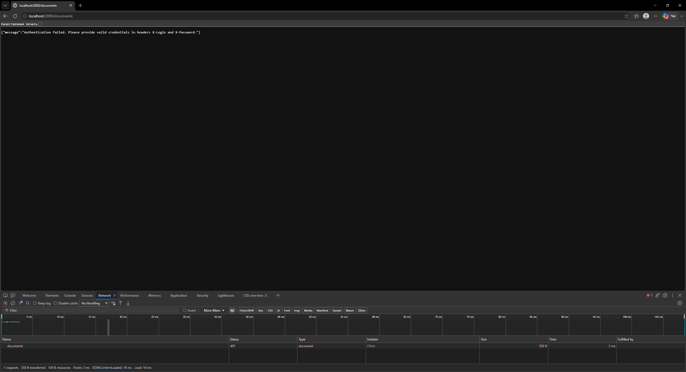
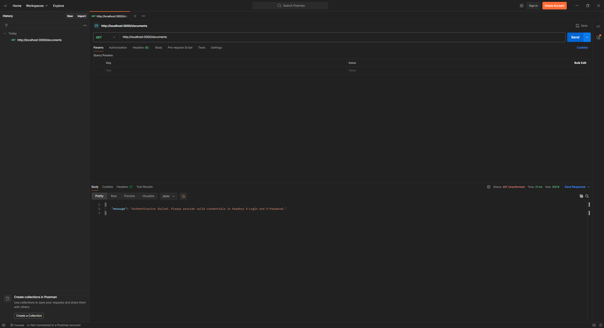
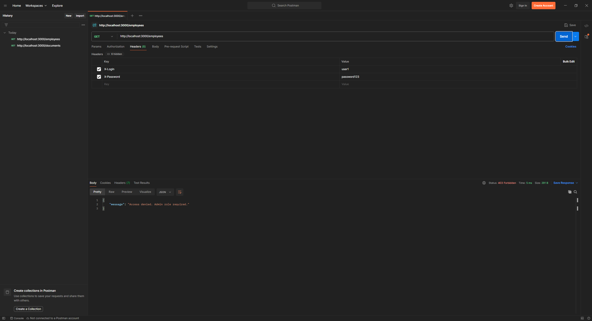
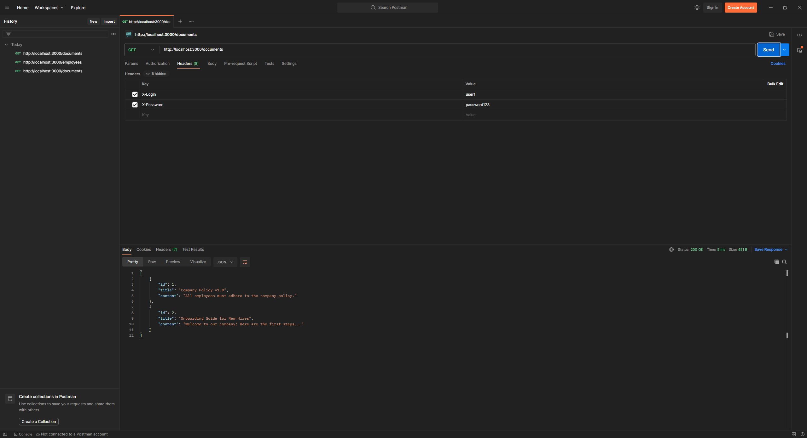
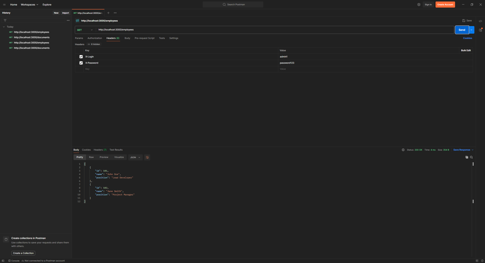
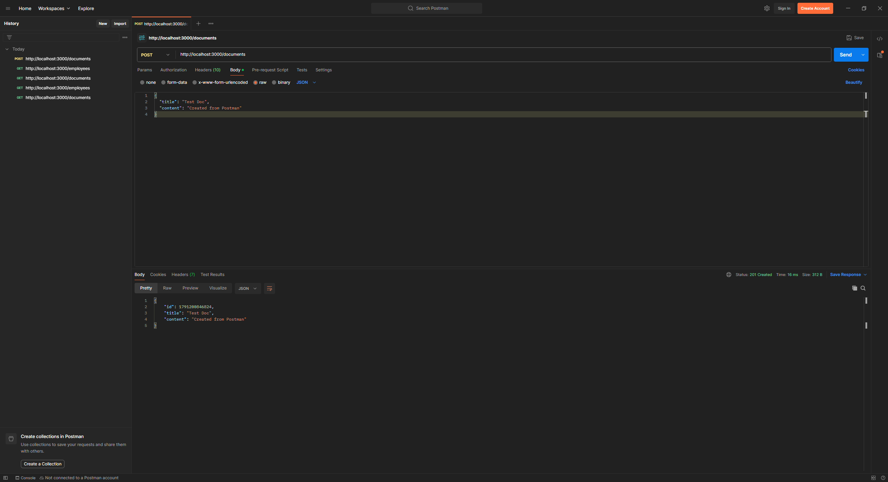
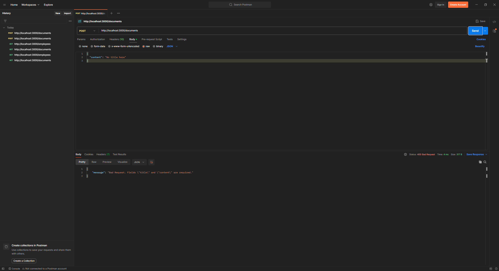
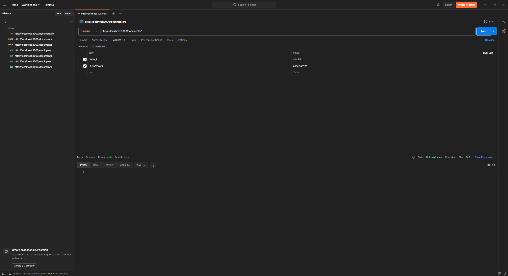
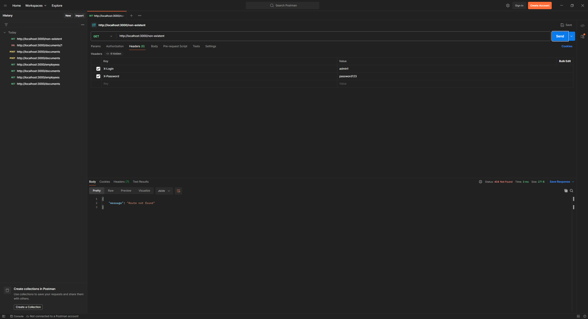

# Лабораторна робота 3

Зробив невеликий REST API на Node.js та Express. Сервер віддає список документів і список співробітників, дозволяє створювати та видаляти документи. Дані лежать у пам'яті в `data.js`, тому після перезапуску все повертається до початкового стану.

Доступ закривають два middleware. `authMiddleware` перевіряє заголовки `X-Login` і `X-Password`, а `adminOnlyMiddleware` пускає до співробітників тільки роль `admin`. Ще один middleware пише в консоль час, метод і URL кожного запиту.

Репозиторій: https://github.com/INotSleep/secure-api-lab3

Запуск

Працював з Node.js 24.21.0 і npm 11.19.0. Потрібен Node.js 18 або новіший, бо `test-client.js` використовує вбудований `fetch`.

```bash
git clone https://github.com/INotSleep/secure-api-lab3.git
cd secure-api-lab3
npm install
npm start
```

Сервер стартує на `http://localhost:3000`, порт можна змінити через змінну `PORT`. Тестовий клієнт запускається в іншому терміналі, поки сервер працює:

```bash
npm test
```

Ендпоінти

Для перевірки є два користувачі: `user1` / `password123` з роллю `user` і `admin1` / `password123` з роллю `admin`. Логін і пароль передаються в заголовках `X-Login` та `X-Password`.

| Метод і URL | Опис | Заголовки | Тіло запиту | Коди відповіді |
| --- | --- | --- | --- | --- |
| `GET /` | Перевірка, що сервер працює | — | — | 200 |
| `GET /documents` | Список документів | `X-Login`, `X-Password` | — | 200, 401 |
| `POST /documents` | Створення документа | `X-Login`, `X-Password` | `{ "title": "Test Doc", "content": "..." }` | 201, 400 без `title` або `content`, 401 |
| `DELETE /documents/:id` | Видалення документа за id | `X-Login`, `X-Password` | — | 204, 404 якщо документа немає, 401 |
| `GET /employees` | Список співробітників | `X-Login`, `X-Password` користувача з роллю `admin` | — | 200, 401, 403 для ролі `user` |
| Будь-який інший | Неіснуючий маршрут | — | — | 404 |

200 означає успішний запит, 201 що документ створено, 204 що документ видалено і тіла у відповіді немає. 400 сервер повертає, коли не вистачає полів, 401 коли логіна й пароля немає або вони неправильні, 403 коли не вистачає прав, 404 коли маршрут або документ не знайдено. Усі помилки приходять як JSON з полем `message`.

Як мінявся код

Створив публічний репозиторій з `.gitignore` для Node, склонував його, виконав `npm init -y` і `npm install express`. Встановився Express 5. Перший `server.js` тільки відповідав на `/`.

Потім додав `data.js` з користувачами, документами і співробітниками та три відкриті маршрути. На цьому етапі список співробітників міг отримати будь-хто.

Далі додав `authMiddleware` і `adminOnlyMiddleware`. Документи стали доступні після входу, а співробітники тільки адміну. Порядок у маршруті важливий: спочатку перевірка входу, потім ролі, бо `adminOnlyMiddleware` бере роль з `req.user`.

`loggingMiddleware` підключив через `app.use()` перед маршрутами, щоб він бачив усі запити, навіть ті, що потім отримують 401 або 404.

На останньому етапі додав перевірку полів у `POST /documents` і маршрут `DELETE /documents/:id`. Тут трохи відійшов від методички. В Express 5 `req.body` буває `undefined`, якщо запит прийшов без тіла, тому беру поля з `req.body ?? {}`. Інакше сервер відповідав би 500 замість 400. `id` з URL перетворюю через `Number`, а не `parseInt`, щоб `/documents/1abc` не видаляв документ 1.

Express сам відповідає на неіснуючий маршрут HTML-сторінкою. Додав обробник, який повертає 404 у JSON, як і решта помилок. Зламаний JSON у тілі запиту теж повертає 400 з `message`.

У `test-client.js` виніс `fetch` в одну функцію і додав перевірки на 401, 201, 400, 204 і 404. Документ для видалення клієнт створює сам, тому тест можна запускати кілька разів без перезапуску сервера. Якщо хоч один статус не збігся, `npm test` завершується з кодом 1.

Перевірка результату

Спочатку відкрив `http://localhost:3000/documents` у браузері. Браузер не надсилає `X-Login` і `X-Password`, тому у вкладці Network видно 401.



У Postman зібрав колекцію з восьми запитів за таблицею з методички. Її можна імпортувати з `docs/secure-api-lab3.postman_collection.json`.

Без заголовків сервер не пускає до документів.



`user1` не має доступу до співробітників.



Той самий `user1` отримує документи, а `admin1` співробітників.





Документ з `title` і `content` створюється, без `title` сервер повертає 400.





Видалення повертає 204 без тіла, а неіснуючий маршрут 404.





`npm test` проходить усі дев'ять перевірок:

```text
[TEST 1] GET /documents
Status: 401 (expected 401) OK
[TEST 2] GET /documents
Status: 200 (expected 200) OK
[TEST 3] GET /employees
Status: 403 (expected 403) OK
[TEST 4] GET /employees
Status: 200 (expected 200) OK
[TEST 5] POST /documents
Status: 201 (expected 201) OK
[TEST 6] POST /documents
Status: 400 (expected 400) OK
[TEST 7] DELETE /documents/1791200188615
Status: 204 (expected 204) OK
[TEST 8] DELETE /documents/1791200188615
Status: 404 (expected 404) OK
[TEST 9] GET /non-existent
Status: 404 (expected 404) OK

--- Tests finished: all passed ---
```

У консолі сервера для кожного запиту з'являється рядок логу:

```text
[2026-10-05T11:36:28.391Z] GET /documents
[2026-10-05T11:36:28.407Z] GET /employees
[2026-10-05T11:36:28.613Z] POST /documents
[2026-10-05T11:36:28.621Z] DELETE /documents/1791200188615
[2026-10-05T11:36:28.629Z] GET /non-existent
```
